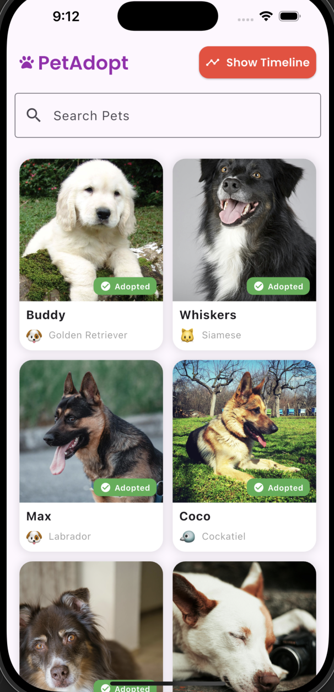
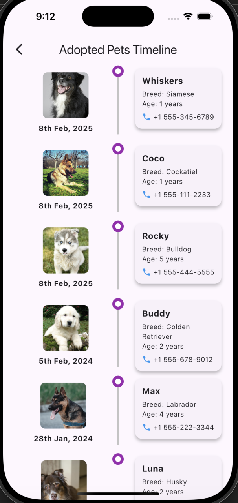
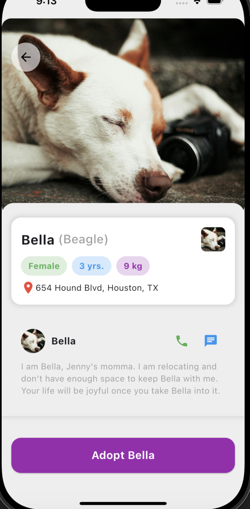
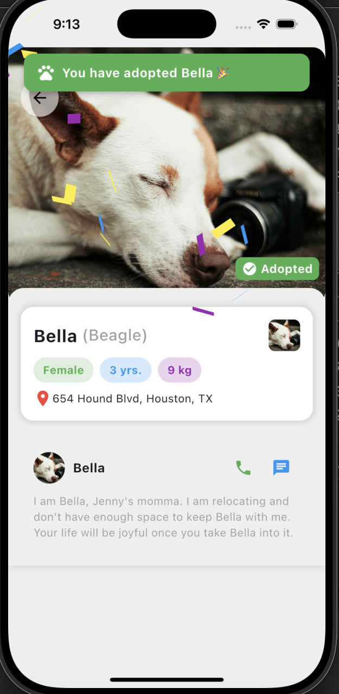
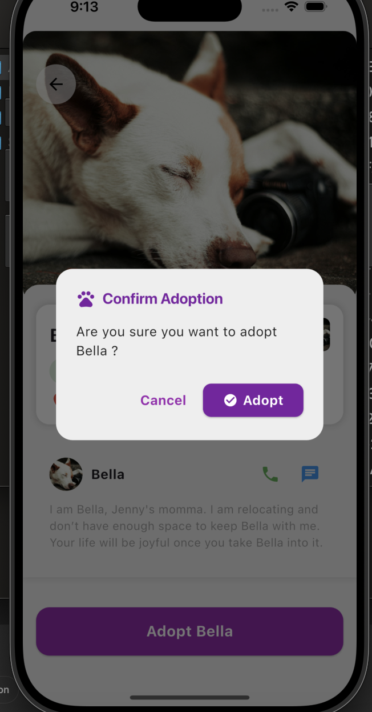

# 🐶 Pet Adoption App

Welcome to the **Pet Adoption App**! This Flutter-based mobile application helps users find and adopt pets seamlessly. Users can browse pets, view details, and mark them as adopted.

## 📸 Screenshots

### Pet Listing Screen


### Adoption Timeline Screen


### Pet Details Screen


### Success Toast Confetti Screen


### Confirm Adoption Screen



## 🚀 Features

- 🐕 Browse a variety of pets available for adoption.
- 📌 View detailed information about each pet.
- ❤️ Mark pets as adopted.
- 🔍 Search and filter pets by breed, age, and category.
- 🏠 Save favorite pets for later.

## 🛠️ Tech Stack

- **Flutter** - Frontend framework
- **Sqflite** - Local database for storing pets
- **Dart** - Programming language

## 📂 Folder Structure

```
├── lib/
│   ├── models/        # Data models
│   ├── services/      # Database services
│   ├── screens/       # UI Screens
│   ├── widgets/       # Reusable components
│   └── main.dart      # Entry point
├── assets/screenshots/ # Screenshots for README
├── test/              # Unit tests
├── pubspec.yaml       # Dependencies
└── README.md          # Project documentation
```

## 📦 Setup & Installation

1. Clone the repository:
   ```sh
   git clone https://github.com/Debdaru07/pet.adoption.git
   cd pet.adoption
   ```
2. Install dependencies:
   ```sh
   flutter pub get
   ```
3. Run the application:
   ```sh
   flutter run
   ```

## 📲 Building the APK

To generate an optimized release APK, run:

```sh
flutter build apk --release --split-per-abi
```

## 🧪 Running Tests

Execute unit tests with:

```sh
flutter test
```

## 📜 License

This project is licensed under the **MIT License**. Feel free to modify and use it as needed.

---

👨‍💻 **Developed by Debdaru Dasgupta**\
🌎 [GitHub](https://github.com/Debdaru07)
🌎 [Portfolio](https://debs-portfolio-1099.netlify.app/#)

